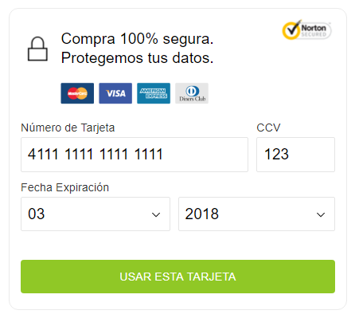

## 3. Mostrar Formulario de Captura de tarjeta

Con la **capture_url** obtenida en el [paso 2](crear-intencion-captura.md) puedes desplegar el formulario de captura de tarjeta. [Puedes hacer clic aquí para ver un ejemplo de capture_url](https://api.sandbox.connect.fif.tech/tokenization/captures/gateways/credit/card/42743d48-7699-0d00-ef45-a68c587e662d/capture)


El cliente debe ingresar los datos solicitados en el formulario y hacer clic en **Usar esta tarjeta** para obtener el token de la tarjeta de crédito.



**Tarjeta de prueba:**

| PAN           | CVV             | Vencimiento  |
| ------------- | --------------- | ------------ |
| 4111111111111111 | 123   | 02/2020             |

La respuesta será enviada a la página de confirmacion indicada en la variable **"return_url"** de la petición a la [API de intención de Captura (paso 2)](crear-intencion-captura.md) o puedes consultar dicha respuesta llamando a la **API Revisión de Captura** de la siguiente forma:

```
 curl -v -X GET 'https://api.sandbox.connect.fif.tech/tokenization/captures/{{id}}' \
 -H 'Content-Type: application/json' \
 -H 'Authorization: Bearer access_token' \
 -d '{
}'| json_pp
```

> Debes reemplazar el **id** por el obtenido en la respuesta de la **API de captura /captures** [paso 2](crear-intencion-captura.md).

**Ejemplo de respuesta enviada a la return_url:**

```
{
    "capture": "PEINAU_CAPTURE",
    "capture_method": "TOKENIZATION",
    "additional_attributes": {
        "reemember_capture": true
    },
    "application": "28adb999-7a2e-70b8-c092-e4c16a9e9e0a",
    "redirect_urls": {
        "return_url": "https://requestb.in/sfoogtsf",
        "cancel_url": "http://www.mysite.cl/cancel"
    },
    "billing": {
        "line1": "Miraflores 222",
        "city": "Santiago",
        "state": "Region Metropolitana",
        "country": "CL"
    },
    "cardholder": {
        "reference_id": "001389",
        "country": "CL",
        "name": "Andres Roa",
        "email": "JLPrueba1@gmail.com"
    },
    "id": "597a0119-d2e6-663d-a40c-e6a2cfc2fd9f",
    "create_time": "2018-02-01T18:20:52.603Z",
    "update_time": "2018-02-01T18:21:32.247Z",
    "deletion_time": "2018-02-02T18:20:52.603Z",
    "state": "captured",
    "capture_number": "INCA-50000001742",
    "gateway": {
        "merchantReferenceCode": "001389",
        "requestID": "5175092920666483104012",
        "decision": "ACCEPT",
        "reasonCode": "100",
        "requestToken": "AhjzbwSTGIrXaIdcgJkMigFRp8Vnq5RMAH2CGTSTL0Yrl+WAEwAA4i4b",
        "paySubscriptionCreateReply": {
            "reasonCode": "100",
            "subscriptionID": "5175092920666483104012"
        },
        "panFirst6": "411111",
        "panLast4": "1111",
        "payment_token": "5175092920666483104012",
        "req_card_number": "xxxxxxxxxxxx1111"
    }
}
```

**Detalle de los campos**

| Nombre        | Tipo            | Descripción  |
| ------------- | --------------- | ------------ |
| id            | String (Guid)   | Identificador único de la intención (Token)             |
| capture       | Enum          | Tipo de Captura establecida en la intención.             |
| capture_method| Enum           | Método de Captura que se usará   |
| cardholder | Object        | Datos del cliente |
| cardholder.reference_id | String        | El código de referencia de la transacción. Representa el identificador de la transacción en el sistema del comercio |
| cardholder.country | String       | País de residencia del cliente |
| cardholder.name | String      | Nombre del cliente tal como se muestra en la tarjeta |
| cardholder.email | String      | Email del tarjeta  |
| billing | String      | Dirección de facturación asociada a la tarjeta  |
| billing.line1 | String      | Dirección de facturación |
| billing.line2 | String      | Dirección 2 de facturación |
| billing.city | String      | Ciudad para facturación |
| billing.state | String      | Comuna de facturación |
| billing.country | String     | País de facturación|
| create_time | String (ISO 8601) | Fecha de creación de la intención |
| update_time | String (ISO 8601) | Fecha de actualización de la intención |
| state | Enum  | Estado actual de la intención |
| capture_number | String (Correlativo) | Identificador legible de la intención |
| panLast4      | String | Cuatro últimos números de la tarjeta |
| redirect_urls | Object      | Url de redirección dependiendo del estado de la captura una vez finalizado el proceso de captura |
| redirect_urls.return_url | String (Url)      | Url de redirección al producirse una captura exitosa |
| redirect_urls.cancel_url | String (Url)      | Url de redirección al producirse una captura fallida |


El **id** generado corresponde al **Token de la tarjeta**.

> **id de ejemplo**"id": "fe5228dc-91ab-fa28-97ec-034bed089743"

Tabla de posibles respuestas:

| State    | Definición                               |
| -------- | ---------------------------------------- |
| captured | Se ha capturado la información de la tarjeta |
| rejected | Ocurrio un error y no se pudo completar la captura |

Ir al paso [4. Intención de Pago](intencion-de-pago.md)
